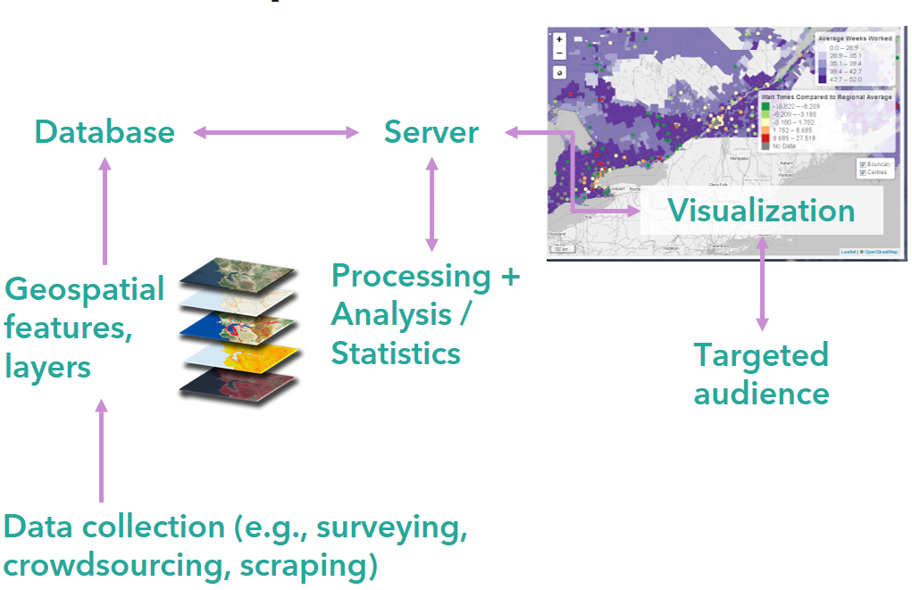

# Public / Open Source Tooling for Geographic Information Science/Analytics/Visualizations

This documentation lists useful tools for manipulating, analyzing and visualizing geographic information. By no means is this list exhausted, rather it's a list of all the tools I have used and I think would be useful for others who want to start leveraging geographic information. Sometimes a paid or enterprise solution (e.g., ArcEnterprise, Tableau) makes sense if your use case is visualizing geographic information, such as for reporting to policy-makers; but if conducting data collection or analytics, then an open source work flow would make more sense for transparency and reproducibility (e.g., R, Python). Throughout this document I specify what tools are more useful depending on your goal and data.

*For public servants: for those creating and working with geographic information, it is important to recognize that [TBS](https://www.tbs-sct.gc.ca/pol/doc-eng.aspx?id=16553) has set geographic data standards, hence there are metadata standards. These standards align with the [Open Geospatial Consortium (OGC)](https://www.opengeospatial.org/), an international is an international consortium which aims to make geogaphic information and services "FAIR - Findable, Accessible, Interoperable, and Reusable."*

Before jumping into geographic data visualization, I highly recommend reading the following blog posts on each of these foundational concepts in GIS:

TO DO: ADD LINKS

- Vector vs. Raster data models in GIS
- Projections
- Cartographic design
- Scale / Modifiable Areal Unit Problem
- Edge Effect

## Terminology

You'll hear Geographic Information Systems, Geographic Information Science, spatial analysis and spatial statistics.

In general, Geographic Information Systems (GIS) leverages geospatial data, statistical/analytical methods and technologies to interpret the “real world”. These technologies (e.g., paid or open source software or programming libraries) are used to store, retrieve, manipulate and display geographic data, but can also support analysis and statistics (further explained below). Check out GIS Technical Architecture below to see what the technical architecture for a GIS.

Geographic Information Science (GIScience), on the other hand, studies data models and computational methods to collect, manipulate, process, analyze and visualize geospatial data. For example, studying methods for the following:
- Validating mining/crowdsourcing geospatial data
- Assessing the spatial distribution of spatially referenced social media posts
- Synthesizing big heterogeneous geospatial data (e.g., street level images + social media posts + infrastructure datasets) to assess accessibility

Spatial analysis and statistics, describes analytics and statistical concepts and methods that are conducted by Geographers (e.g. modifiable areal unit problem, spatial autocorrelation), which depends on a GIS. Spatial analysts, statisticians and scientists depends on a technical architecture to collect, store, manage, manipulate, run models, and visualize results.

## *General* GIS Technical Architecture

The following is an example of a GIS. Esri's software offers an entire GIS, which is useful for organizations that needs an enterprise solution to visualize geographic information; however, there are risks of tech dependency and black box methods. With open source you can build your own GIS, and since source code is publicly accessible, this allows for a transparent and reproducible workflow, which (in my opinion) is important for research and policy. That said, an open source GIS approach requires more knowledge on software development and coding (R, Python, Javascript).

Starting at the bottom-left corner, you'll see "Data collection", here it can be your own method for collecting data (e.g., survey) or obtaining data from existing geographic data source (some are provided below). Once you have your desired data (AKA geospatial features and layers), you will need to store that data in static files (if the data is small enough, like if you have 1000 data points) or a database (if the data is large, like multiple layers of polygons at different scales). With data stored, you can then read it into a sever that hosts scripting to process/analyze/visualize the geographic information.

The rest of this document discuss some data sources and the technologies to accomplish storing, processing, analyzing and visualizing your geographic information.

## Geographic Open Data Sources

The following are geographic data source I use regularly.

- [OpenStreetMap (OSM)](https://www.openstreetmap.org/), an international crowdsourcing project aimed at collecting an open source dataset of geographic information. Within Canada, there has been academic research to assess the quality of OSM data (Jacobs 2017; Zhang 2018)
  - Download OSM data from [Geofabrik](https://www.geofabrik.de/data/download.html), a web site that allows you to download the data in different formats and at different geographic scales (e.g., Canada, provincial, territorial, cities)
  - Contribute and download OSM data from [Java OSM (JOSM)](https://josm.openstreetmap.de/). JOSM is an open-source graphic interface to contribute, edit, validate OSM data, but can also be used to extract and visualize geospatial data as well
- Provincial and municipal open data portals
- [Statistics Canada boundary files](https://www12.statcan.gc.ca/census-recensement/2011/geo/bound-limit/bound-limit-eng.cfm) (e.g., Provinces/Territories, Economic Regions, Census Subdivision, Dissemination Areas)
- [Federal Geospatial Platform](https://www.nrcan.gc.ca/science-data/science-research/earth-sciences/geomatics/canadas-spatial-data-infrastruct/geospatial-communities-canadian/federal-geospatial-platform/11031)

## Data Creation and Manipulation

### Desktop Software
- [Esri proprietary software (ArcMap, ArcPro, ArcEnterprise, ArcOnline)](https://www.esri.com/en-us/home) can be used to manage, analyze, and visualize geospatial data. ArcPro is currently available to download in the department, and ArcEnterprise and ArcOnline will become more accessible to the department once deployed
- [QGIS](https://qgis.org/en/site/) is an open-source graphical software that is most similar to ArcMap and ArcPro. It is used to manage, analyze, and visualize spatial data. QGIS uses GDAL and you can use various open source extensions to conduct specific analyses or visualizations

#### Open Source Programming Libraries
- [Geospatial Data Abstraction Library (GDAL)](https://gdal.org/) is an open-source library for managing geospatial data
- D3.js is an open-source library for visualizing data
- geojson.io allows you to edit GeoJSONs easily
- Mapshaper
- minjur is an open-source library for managing OSM data
- osmosis is an open-source library for managing OSM data

## Spatial Data Storage

In general, spatial databases allow users to “model, store, retrieve, and query” spatially-referenced objects (Shukla et al. 2016). Unlike non-spatial databases, spatial databases allow for spatial data types, spatial indexing and spatial functions. For example, a user can query all objects that are referenced as customers within a certain geographic distance or bounding box. To develop a powerful web app that filters and visualizes large amounts of data onto interactive maps, sometimes a database and server are required to prevent the browser from lagging and/or crashing from loading too much data into its memory (i.e., web server). In other words, spatial databases can support a thin client architecture (Agrawal and Gupta 2017, p. 521). Spatial databases can also be connected to Desktop GIS platforms (e.g., ArcGIS or QGIS) or programming languages (e.g., python and R) for spatial analytics/statistics and geographic information science.

The quantity, diversity and type of data, as well as the hardware, will affect what database is most suitable. For example, Shukla et al. (2016) compared the performance between Oracle Spatial and PostgreSQL PostGIS. In their research, they executed similar simple queries (e.g., `select sdo_geom.sdo_length(geom,0.005) from nyc_streets where name-‘Columbus Cir’`) on both databases (p. 99). They found “[t]here was a minimum of 50% difference between Oracle Spatial and PostGIS in all the queries;” in other words, PostGIS was faster at returning the queries (ibid.). However, the computer resources necessary to accomplish the query are more costly on PostGIS. Shukla conclude that yes, PostGIS is faster at querying, but there are trade-offs with computation costs.

Below is a table I made in 2018, thought I'd just share it.

|    Name                                                                             |    Data Types                                                                            |    Object Types                                                                                      |    Supported Spatial Functions                                                                    |    Supported Spatial Indexes                |    Horizontal Scalability    |    Supported by Other Tools                                                                                   |    Open Source    |
|-------------------------------------------------------------------------------------|------------------------------------------------------------------------------------------|------------------------------------------------------------------------------------------------------|---------------------------------------------------------------------------------------------------|---------------------------------------------|------------------------------|---------------------------------------------------------------------------------------------------------------|-------------------|
|    [PostgreSQL](https://www.postgresql.org/) +     [PostGIS (PostgreSQL extension)](https://postgis.net/) +    [PGAdmin (PostgreSQL GUI)](https://www.pgadmin.org/)    |    Geometry or Geography                                                                 |    Point,   LineString, Polygon, MultiPoint, MultiLineString, MultiPolygon, Geometry   Collection    |    Meets Simple Features for SQL   specification from the Open Geospatial Consortium (OGC)        |    B-trees,   R-trees, or GiST              |    No                        |    Geospatial   Data Abstraction Library (GDAL), QGIS, R, Esri, Anaconda, GeoServer,   Microsoft Azure        |    Yes            |   
|    [MongoDB](https://www.mongodb.com/)                                                                          |    Spherical   (similar to Geography) or Flat (similar to Geometry) spatial types        |    Point,   LineString, Polygon, MultiPoint, MultiLineString, MultiPolygon, Geometry   Collection    |    Does   not meet Simple Features for SQL specification from the OGC                             |    2dsphere   index, 2d index               |    Yes   (sharding)          |    Support   is weak. For example, there is an unsupported plug-in to GeoServer                               |    Yes            |
|    [Microsoft SQL Server 2016](https://www.microsoft.com/en-us/sql-server/sql-server-2016)   (Approved)                                           |    Geometry or Geography                                                                 |    Point,   LineString, Polygon, MultiPoint, MultiLineString, MultiPolygon, Geometry   Collection    |    Meets   Simple Features for SQL specification from the OGC                                     |    2d   plane index, B-trees                |    No                        |    Esri, Shape2SQL, QGIS, R, Anaconda, GDAL                                                                   |    No             |
|    [Oracle + Spatial](http://www.oracle.com/technetwork/database/options/spatialandgraph/documentation/index.html) (In-Built Feature)   (Approved?)                                |    SDO_Geometry                                                                          |    Point,   LineString, Polygon, MultiPoint, MultiLineString, MultiPolygon, Geometry   Collection    |    Does   not meet Simple Features for SQL specification from the OGC                             |    R-trees,   grid-based spatial indexes    |    No                        |    Esri                                                                                                       |    No             |

## Geo Visualizations

- Leaflet is an open-source JS library to develop interactive maps
- Mapbox Studio is an open-source graphical interface for designing map layers as well as developing data-driven styling
- Mapbox GL JS is an open-source library for developing interactive web maps
- Mapbox Cartogram is an open-source tool to help design a map layer based on a reference image
- osm2geojson is an open-source library for converting OSM data to GeoJSON(s)
- Tableau

|    Name                     |    Features                                                                                                                                          |    Limitations                                                                                                                |
|-----------------------------|------------------------------------------------------------------------------------------------------------------------------------------------------|-------------------------------------------------------------------------------------------------------------------------------|
|    Mapbox GL JS             |    ·     Open source   ·     Create 2D + 3D interactive maps   ·     Customisable   ·     Built on Leaflet.js + more   ·     Visualize 3D objects    |    ·     Documentation can be hard to follow                                                                                                                     |
|    D3.js                    |    ·     Open source   ·     Customisable   ·     Create maps that can show movement (e.g., migration)                                               |    ·     Not as intuitive to develop with compared to other JavaScript   libraries   ·     For simple map visualizations      |
|    Leaflet.js (Approved)    |    ·     Customisable   ·     Open source   ·     Create interactive maps   ·     Many third party extensions                                        |    ·     Less frequent development because the original creator now works at   Mapbox and works on developing Mapbox GL JS    |

## Work Cited

## Author
Julia Conzon
